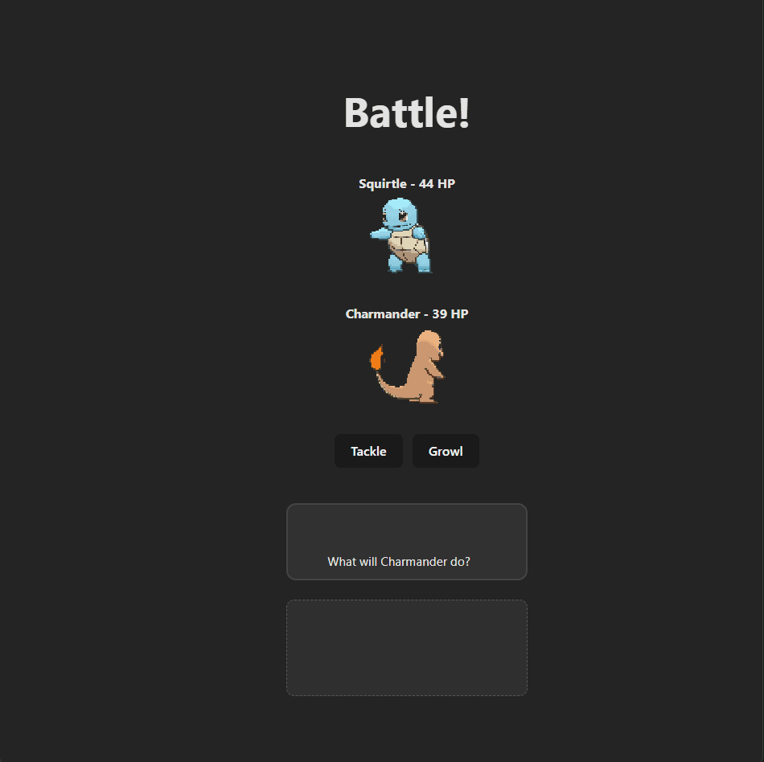
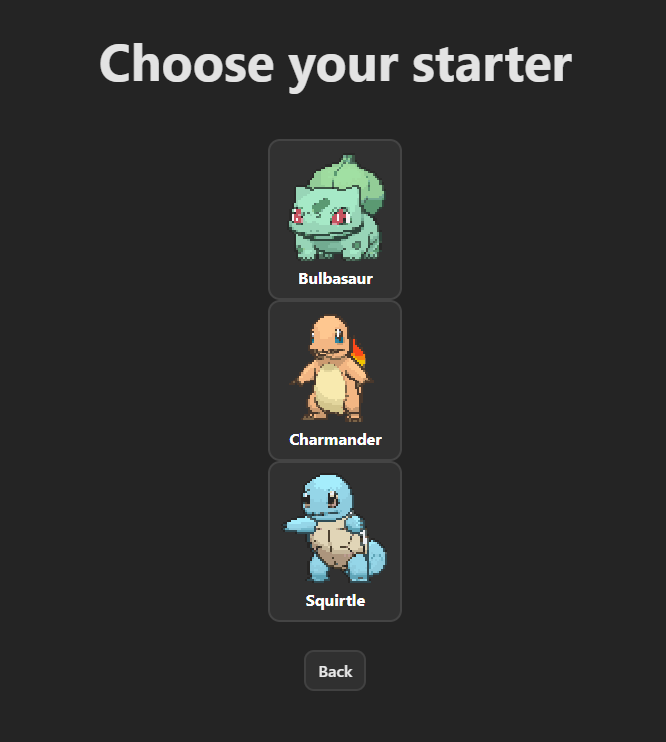
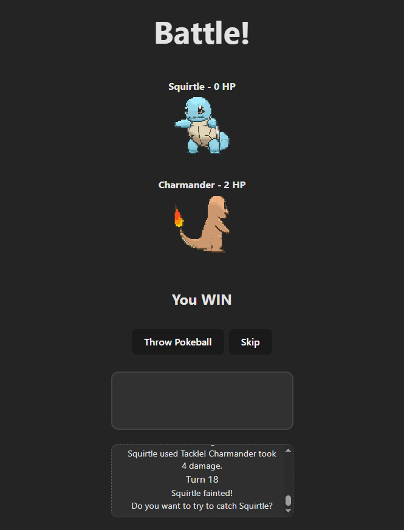

# RogueMon – Pokémon-Inspired Roguelike (MVP)

RogueMon is a web-based roguelike inspired by classic Pokémon battles.
Frontend: React (Vite). Backend: Python/Flask. The MVP uses a modular battle engine and a centralized message pipeline for consistent UX.



---

## Tech Stack

- Frontend: React (Vite), JavaScript, HTML/CSS
- Backend: Python, Flask
- Tooling: Node/NPM, concurrently, Git/GitHub, Postman
- Concepts: REST endpoints, modular helpers/services, trunk-based development

---

## MVP Features

- Turn-Based Battle Loop — handles turn logic, damage calculation, faint handling, and victory/defeat resolution
- Capture Flow — single-use capture attempt surfaced via MessageBox after faint resolution
- MessageBox Pipeline — all battle/capture/skip messages flow through a central component (no ad-hoc toasts)
- Starter Selection — Main Menu → StarterSelect → BattleScreen (Gen-1 starters)
- Modular Backend — helpers/services at module scope; Flask endpoints return normalized JSON payloads

---

## Quick Start (Local)

**Prerequisites:** Node 18+, Python 3.10+, NPM

### 1. Clone the Repository
```bash
git clone https://github.com/NathanielCarballo/RogueMon.git
cd RogueMon/MVP
```

### 2. Set Up the Python Virtual Environment

**Windows (PowerShell)**
```powershell
cd backend
python -m venv .venv
. .venv\Scripts\Activate.ps1
pip install -r requirements.txt
cd ..
```

**macOS/Linux**
```bash
cd backend
python3 -m venv .venv
source .venv/bin/activate
pip install -r requirements.txt
cd ..
```

### 3. Install Frontend Dependencies
```bash
cd frontend
npm install
```

### 4. Run Both Servers (Frontend + API)

Run this command from `/MVP/frontend`:

```bash
npm run dev:all
```

Alternate scripts (from `/MVP/frontend`):
```bash
# Run only the React client
npm run dev

# Run only the Flask API (Windows-specific venv path in package.json)
npm run dev:api
```

**Note:** `dev:api` in `package.json` runs `cd ..\backend && .\.venv\Scripts\python.exe app.py` on Windows.  
On macOS/Linux, activate the venv in `/MVP/backend` and run `python app.py` manually.

---

## Folder Structure

```
MVP/
├─ backend/
│  ├─ app.py                # Flask entrypoint
│  ├─ battle_engine.py      # core battle loop/logic
│  ├─ starters.py           # starter data/utilities
│  ├─ requirements.txt      # Python dependencies
│  └─ (helpers/services/routes as needed)
├─ frontend/
│  ├─ package.json          # dev, dev:api, dev:all scripts (Windows venv path for API)
│  ├─ vite.config.js
│  ├─ index.html
│  ├─ src/
│  │  ├─ screens/
│  │  │  ├─ MainMenu.jsx
│  │  │  ├─ StarterSelect.jsx
│  │  │  ├─ BattleScreen.jsx
│  │  │  └─ WelcomeScreen.jsx
│  │  ├─ assets/
│  │  │  └─ react.svg
│  │  ├─ App.css
│  │  ├─ App.jsx
│  │  ├─ main.jsx
│  │  └─ index.css          # central styles (project rule)
│  └─ public/
├─ docs/
│  ├─ starter-screen.png
│  ├─ battle-preview.gif
│  └─ capture-flow.png
└─ README.md
```

---

## Design Notes

- Message Routing: All user-facing battle events (faint, capture prompt, skip) flow through MessageBox to keep UX predictable and testable.
- API Contracts: Battle actions return normalized JSON (state deltas + message payloads) for the client to render.
- Modularity: Helpers/services live at module scope to keep the battle engine compact and composable.
- Dev Flow: Trunk-based with short-lived feature branches + PRs to keep diffs tight and reviews quick.

---

## Roadmap

- [ ] Persist runs and team state to localStorage
- [ ] Procedural encounter routes and encounter randomization
- [ ] Trainer battles with simple AI turns
- [ ] Expand move pool and elemental/resist tables
- [ ] Unit tests (pytest) for battle math & message pipeline

---

## Screens

| Starter Select | Battle Screen | Capture Flow |
|---|---|---|
|  |  |  |

---

## Author

Nathaniel Carballo  
Full-Stack/Backend Developer (Python • C# • JavaScript)  
GitHub: https://github.com/NathanielCarballo
